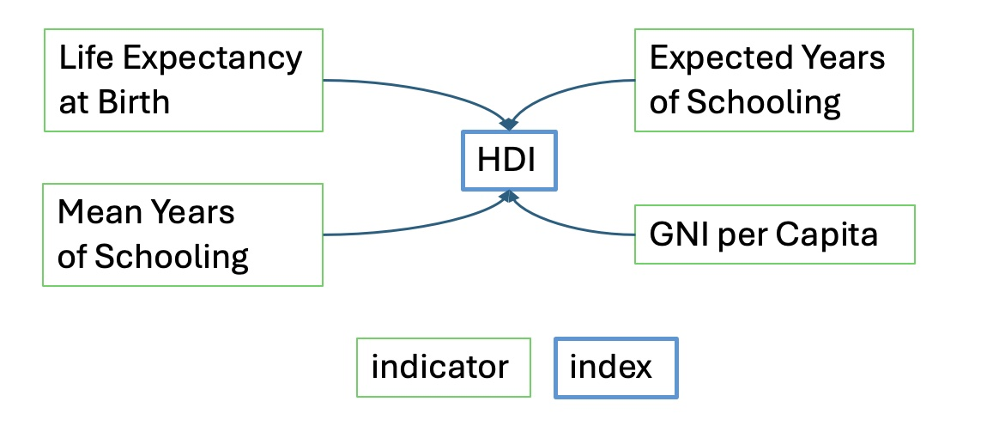
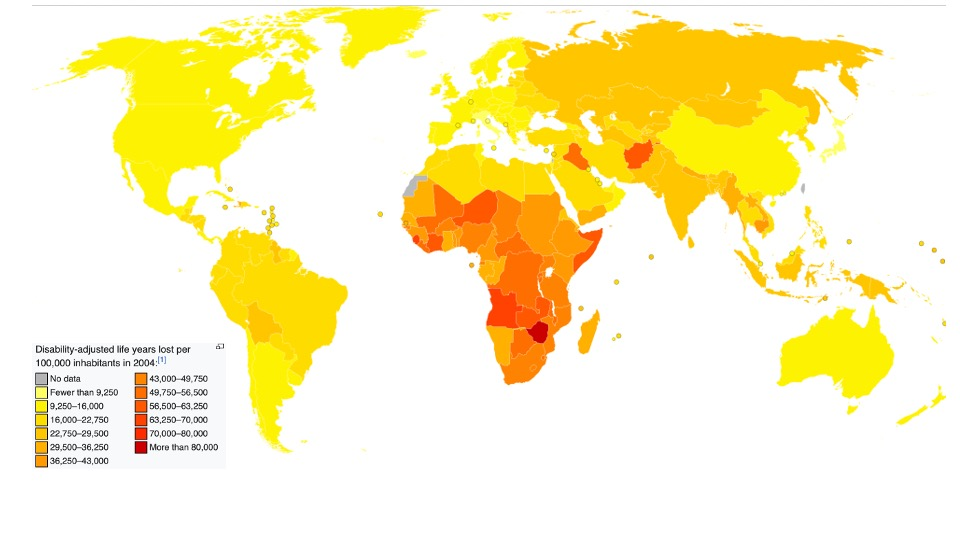
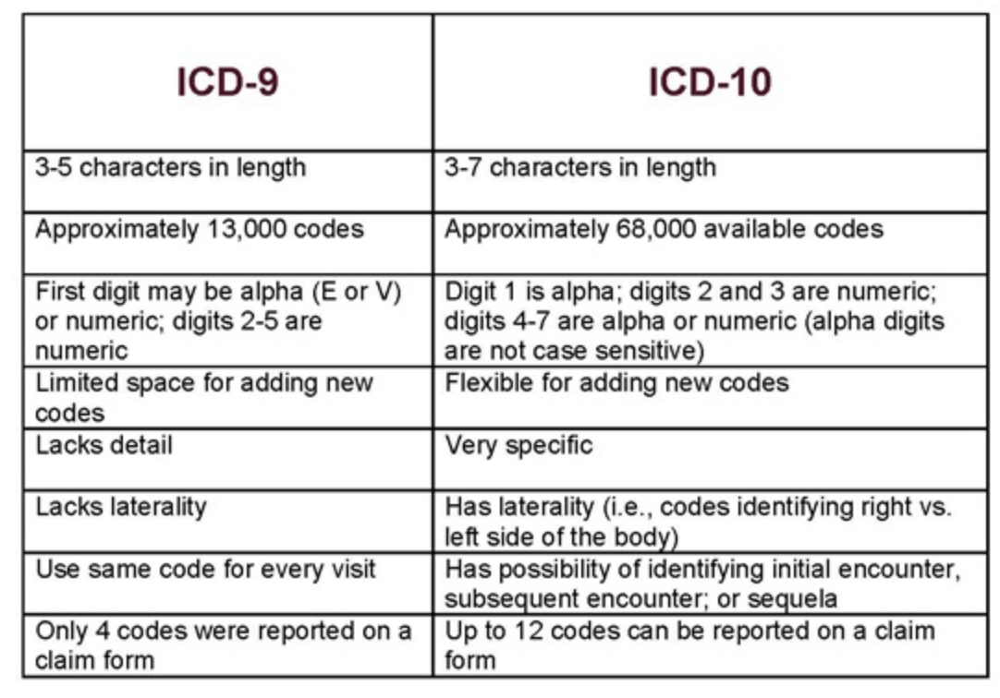
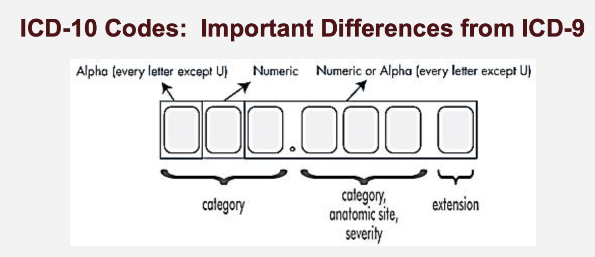

```{=html}
<style>
.circle {
  background-color: #FFCCCB; /* Light red background */
  border: 2px solid teal; /* Teal border */
  border-radius: 50%; /* Makes the circle round */
  color: teal; /* Teal text color */
  width: 75px; /* Circle diameter */
  height: 75px; /* Circle diameter */
  display: inline-block;
  text-align: center;
  line-height: 75px; /* Match the height to center the text vertically */
  vertical-align: middle; /* Aligns the circle vertically with adjacent text */
  margin-right: 5px;
}
</style>
```
```{=html}
<style>
.highlight-box {
  background-color: yellow;
  padding: 10px;
  border-radius: 5px;
}
</style>
```
```{=html}
<style>
ul {
  font-size: 85%;
}

ul ul {
  font-size: 75%;
}
</style>
```
{fig-align="center"}

# [**Chapter Overview**]{style="color: blue;"}

-   **Health Indicators and Indices**: What are their characteristics and why are they important?
-   **Sources and Evaluation of Health Data**: Primary, secondary data, passive and active collection.
-   **Disease Definition and Classification**: How do we classify diseases? (ICD9, ICD10-codes)


------------------------------------------------------------------------

## [1]{.circle} [**Health Indicators and Indices**]{style="color: teal;"}

-   **Health Indicators**: Directly measurable variables reflecting a population's health such as infant mortality rate and life expectancy.
-   **Health Indices**: Composite measures combining multiple indicators to give an overview of health status, like the Human Development Index.

{fig-align="center" width="527"}

-   See [**Box 3.1**]{.highlight-box} and [**Box 3.3**]{.highlight-box} for more details.

------------------------------------------------------------------------

### [**Evaluating Health Indicators**]{style="color: pink;"}

-   How are health indicators used to monitor and assess population health, informing public health decisions and policy-making?

::: columns
::: {.column width="45%" style="font-size: 24px; line-height: 1.2;"}
#### Essential Qualities {style="color: blue;"}

-   **Reliability/Reproducibility**: Consistent results across studies and time.
-   **Validity**: Accurately measures what it is intended to measure.
-   **Sensitivity**: Detects changes or differences that are meaningful.
:::

::: {.column width="45%" style="font-size: 24px; line-height: 1.2;"}
#### Practical Qualities {style="color: blue;"}

-   **Acceptability**: Acceptable to those who are assessed by the indicator.
-   **Feasibility**: Can be realistically collected and sustained.
-   **Universality**: Applicable across different settings and populations.
:::
:::

------------------------------------------------------------------------

## [2]{.circle} [**Sources and quality of health data**]{style="color: teal;"}

-   See [**Table 3.1**]{.highlight-box} -sources of data to compilate indicators.
-   Health data sources are crucial for compiling health indicators.
-   Data can originate from individuals, healthcare providers, or be generated through health surveys and administrative databases.

### [**Active or passive?**]{style="color: pink;"}

-   **Active Data Sources**: Require efforts to solicit and collect information, e.g., health surveys.
-   **Passive Data Sources**: Routinely submitted by other entities, e.g., vital statistics.

------------------------------------------------------------------------

### [**Primary and Secondary Data Sources**]{style="color: pink;"}

-   **Primary Data Sources**: Specifically collected for the purpose of health monitoring (e.g. disease registries and some health surveys).

    -   **Electronic Health Records (EHR)**: Detailed, real-time, patient-centered records.
    -   **Disease Registries**: Used to estimate disease incidence and prevalence, like cancer registries.

-   **Secondary Data Sources**: Originally designed for other purposes but also used in health monitoring (e.g.administrative databases for Medicare and Medicaid).

------------------------------------------------------------------------

### [**Health Information System (HIS)**]{style="color: pink;"}

-   An organized set of activities whose purpose is to **gather, maintain, and provide health-related information** to improve health outcomes.

-   Components:

    -   Disease registries
    -   Utilization databases
    -   National health surveys

------------------------------------------------------------------------

### [**Disease Registries and Notifiable Diseases**]{style="color: pink;"}

-   **Disease Registries**
    -   Important for estimating disease incidence and prevalence.
    -   Cover various conditions from cancer to communicable diseases.
-   **Notifiable Diseases**
    -   Diseases that must be reported to national health authorities.
    -   Managed by systems like the CDC's National Notifiable Diseases Surveillance System.

------------------------------------------------------------------------

### [**Utilization of Health Data**]{style="color: pink;"}

-   **Measuring Health Service Utilization**
    -   Utilization data from Medicare, Medicaid, and health maintenance organizations provide insights into health service use.
-   **Health Surveys**
    -   Gather data on health behaviors, practices, and perceptions.
    -   Vary by mode of interview and can be influenced by respondents' perceptions and recall accuracy.
    -   See [**Table 3.2**]{.highlight-box} for pros and cons of survey type
    -   Cross-section (versus longitudinal)
    -   Likert scale!
    -   Self-rated survey
        -   Surprisingly good (dynamic)
    -   QOL - see the one for [Charlotte, NC](https://maps.mecklenburgcountync.gov/qol/)

------------------------------------------------------------------------

### [**Linking health data**]{style="color: pink;"}

-   **Enhanced Insights**: Linking different data sources can provide a more comprehensive view of health outcomes.

-   **Examples of Linked Data**: Combining EHRs with national health surveys or insurance claim data.

-   **Data Challenges**

    -   **Data Integrity and Privacy**: Managing the accuracy and confidentiality of linked data is paramount.
        -   [**HIPAA!**]{style="color: red;"}
        -   [List of HIPAA identifiers](https://www.hhs.gov/hipaa/for-professionals/special-topics/de-identification/index.html)
    -   **Analytical Complexity**: The use of linked data often requires advanced statistical techniques to manage biases and variability.

------------------------------------------------------------------------

## [3]{.circle} [**Summary measures of population health**]{style="color: teal;"}

### [**Integrating Mortality and Morbidity**]{style="color: pink;"}

-   Health indices like DFLE, DALE, DALY, HALE, QALY, and HLY combine measures of mortality with morbidity or disability into a single comprehensive figure.
-   These measures differ in how they account for morbidity:
    -   Activities of daily living
    -   Self-rated health
    -   Activity limitations (institutional and non-institutional)

------------------------------------------------------------------------

### [**Quality-Adjusted Life Years (QALY)**]{style="color: pink;"}

-   **Definition**: A measure that combines the length of life with the quality of life in a single index number.

-   **Calculation**: Each year in perfect health is counted as one QALY, while years lived with illness or disability are adjusted according to the severity of the health condition.

------------------------------------------------------------------------

### [**Disability-Adjusted Life Years (DALY)**]{style="color: pink;"}

-   **Definition of DALY**: A measure that combines mortality (Years of Life Lost, YLL) and morbidity (Years Lived with Disability, YLD) into a single metric.
-   **Why DALY Matters**: Helps policymakers understand the burden of disease and prioritize interventions effectively.
-   **Components of DALY**:
    -   **YLL (Years of Life Lost)**: Premature death due to specific causes.
    -   **YLD (Years Lived with Disability)**: The impact of non-fatal health conditions on quality of life.

------------------------------------------------------------------------

### [**DALY: let's dive in (1)**]{style="color: pink;"}

-   **Mortality Contribution (YLL)**:
    -   Leading causes of premature death: cardiovascular disease, cancer, infectious diseases.
    -   How reductions in mortality affect overall DALY burden.
-   **Morbidity Contribution (YLD)**:
    -   Chronic diseases like diabetes, mental health disorders, and musculoskeletal conditions.
    -   The role of disability weight in calculating burden.

------------------------------------------------------------------------

### [**DALY: let's dive in (2)**]{style="color: pink;"}

-   **Comparing YLL and YLD**:
    -   Some diseases cause high YLL (e.g., heart disease), while others contribute more to YLD (e.g., mental disorders, arthritis).
    -   Policy implications: balancing treatment for high-mortality vs. high-disability conditions.
-   **Intervention Strategies**:
    -   Preventative measures to reduce YLL (e.g., vaccinations, tobacco control policies).
    -   Managing chronic conditions to reduce YLD (e.g., rehabilitation programs, mental health support).
-   [Great article from health data](https://www.healthdata.org/research-analysis/library/global-incidence-prevalence-years-lived-disability-ylds-disability)

------------------------------------------------------------------------

### [**DALY: let's dive in (3)**]{style="color: pink;"}

-   **Global and Local Comparisons**:
    -   How DALY burden varies by income level, access to healthcare, and social determinants.

{fig-align="center" width="527"}

------------------------------------------------------------------------

### [**DALY: takeaways**]{style="color: pink;"}

-   **DALY as a Critical Metric**: Essential for public health planning and resource allocation.
-   **Balancing Mortality & Morbidity Interventions**: Addressing both premature death and quality of life impairments.
-   **Health Equity Considerations**: Ensuring interventions reach vulnerable populations.
-   **Data-Driven Public Health Strategies**: Using DALY to guide policy decisions and optimize healthcare spending.

------------------------------------------------------------------------

## [4]{.circle} [**Understanding ICD-9 and ICD-10 Codes**]{style="color: teal;"}

-   **What is ICD?**
    -   The International Classification of Diseases (ICD) is a standardized system for classifying diseases, conditions, and procedures.
    -   Maintained by the **World Health Organization (WHO)**, it is used for healthcare administration, epidemiology, and research.

------------------------------------------------------------------------

### [**Transitioning from ICD9 to ICD10**]{style="color: pink;"}

-   **Transition from ICD-9 to ICD-10**:
    -   ICD-9 had **\~13,000 codes**, while ICD-10 expanded to **\~68,000 codes**.
    -   Greater **specificity and accuracy**, especially in classifying complex diseases.
    -   Improved tracking of **public health trends and emerging diseases**.
-   **Key Differences Between ICD-9 and ICD-10**:
    -   **Specificity**: ICD-10 codes provide detailed descriptions, including laterality (left vs. right).
    -   **Combination Codes**: ICD-10 combines multiple conditions into a single code (e.g., **diabetes with kidney disease**).
    -   **Expanded Code Structure**: ICD-10 uses **alphanumeric codes (A00-Z99)** compared to the numeric structure of ICD-9.

------------------------------------------------------------------------

### [**Examples of ICD9 and ICD10 codes (1)**]{style="color: pink;"}

{fig-align="center" width="427"}

------------------------------------------------------------------------

### [**Examples of ICD9 and ICD10 codes (2)**]{style="color: pink;"}

{fig-align="center" width="377"}

------------------------------------------------------------------------

### [**Why are these codes important?**]{style="color: pink;"}

-   **Disease Monitoring**: ICD codes allow epidemiologists to **track disease outbreaks** (e.g., COVID-19 had its own ICD-10 codes: **U07.1 for confirmed cases**).

-   **Healthcare Reimbursement**: Ensures accurate **billing and insurance claims**.

-   **Policy and Research**: Facilitates **international comparisons** of health data.

------------------------------------------------------------------------

### [**In-class exercise**]{style="color: pink;"}

-   Let's look at this patient. The principal diagnosis (ICD9 code is **V3000**; look it up)

-   These are secondary diagnoses - look them up - 76502, 77181, 7707, 77212, 77081, 7470, 7455, 77182, 2760, 76522, 7742, 769, 04110, 7793, 6910, 75432, 4019, 0416, 0413, 9999, 2768.

-   *What can we tell about this patient?*


